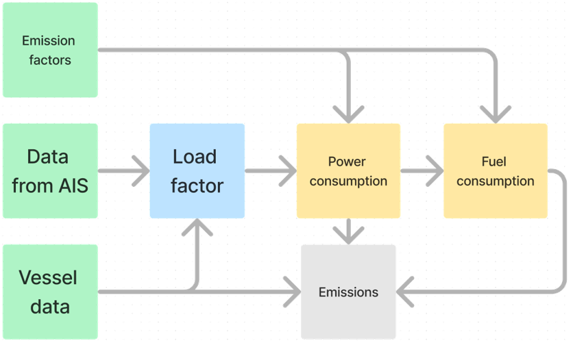

# Maritime Emissions (MarU)

    

 

Maritime Emissions (MarU) is the Norwegian Coastal Administration's model for AIS-based estimation of ship traffic emissions. The model is based on methodology from The International Council of Clean Transport (ICCT) and
[the fourth GHG Study](https://www.imo.org/en/ourwork/Environment/Pages/Fourth-IMO-Greenhouse-Gas-Study-2020.aspx) from the International Maritime Organization (IMO), as well as previous models such as Havbase and Marine Emission (proof of concept). 

The model is written in Python (PySpark).

## Data flow

For detailed data flow, see [notebooks](docs/notebooks.md)

## Data sources

| Table Name | Description |
|------------|-------------|
| AIS Data | Data from the Automatic Identifaction System (AIS). |
| Areas | Geographic areas. Used to enrich AIS data and calculate emissions within the areas. |
| Vessel | Ship register combined from several sources (IHS Markit, ShipInfo, SafeSeaNet, NOR and NIS flag registers) enriched with specific logic, such as fuel type and size groups. |
| Emission Variables | Input of various factors for emissions. |

## Abbrevations and logic
### Phases
- a: anchor
- aq: aquacultur
- c: cruise
- dp-o: dynamic positioning offshore
- f: fishing
- m: maneuver
- n: node (berth)
- p: using shore power

### Voyage types
- Berthed: Voyage type is set to "Berthed" if the voyage has a defined stop. 
- Domestic: First country visited is Norway or Svalbard, and last country visited is Norway or Svalbard. 
- International out: First country visited is Norway or Svalbard 
- International in: Last country visited is Norway or Svalbard 
- Transit: None of the above. 
