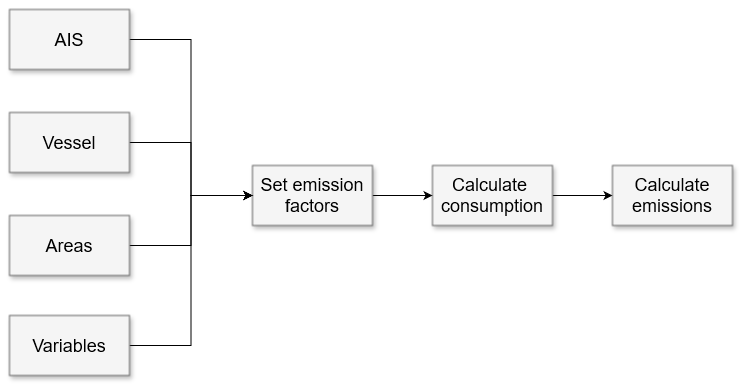
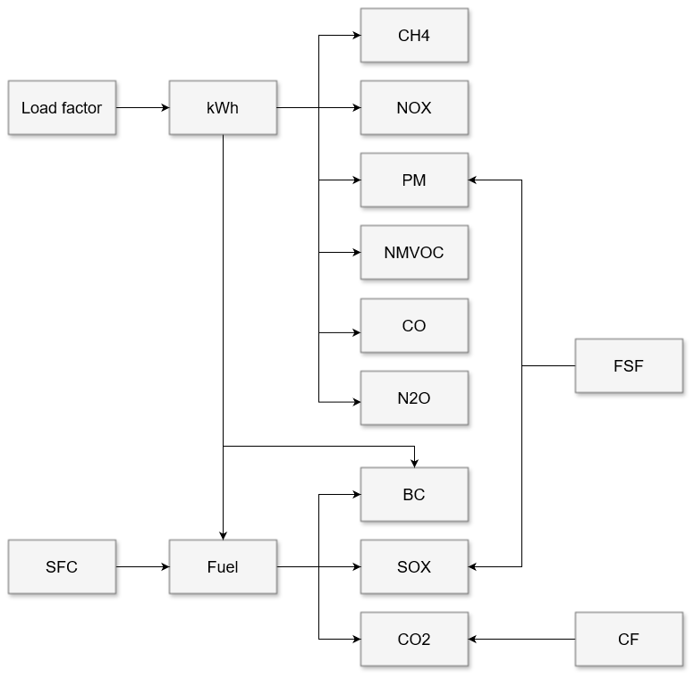

# Maritime Emissions (MarU)

    

 

Maritime Emissions (MarU) is the Norwegian Coastal Administration's model for AIS-based estimates of ship traffic emissions. The model is based on methodology from The International Council of Clean Transport (ICCT) and
[the fourth GHG Study](https://www.imo.org/en/ourwork/Environment/Pages/Fourth-IMO-Greenhouse-Gas-Study-2020.aspx) from the International Maritime Organization (IMO), as well as previous models such as Havbase and Marine Emission (proof of concept). 

The model is written in Python (PySpark).

